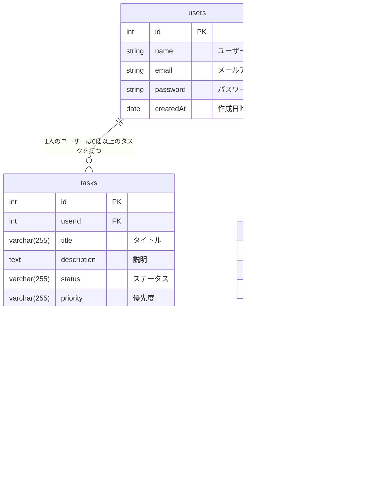

```mermaid
erDiagram

users ||--o{ tasks : "1人のユーザーは0個以上のタスクを持つ"
tasks ||--o{ tasks_tags : "1個のタスクは0個以上のタグを持つ"
tags ||--o{ tasks_tags : "1個のタグは0個以上のタスクを持つ"
users ||--o{ tags : "1人のユーザーは0個以上のタグを持つ"

users {
	int id PK
	string name "ユーザー名"
	string email "メールアドレス"
	string password "パスワード"
	date createdAt "作成日時"
}

tasks {
	int id PK
	int userId FK
	varchar(255) title "タイトル"
	text description "説明"
	varchar(255) status "ステータス"
	varchar(255) priority "優先度"
	date expiresAt "期限"
	date completedAt "完了日時"
}

tags {
	int id PK
	int userId FK
	varchar(255) name "タグ名"
}

tasks_tags {
	int id PK
	int taskId FK
	int userId FK
}
```
